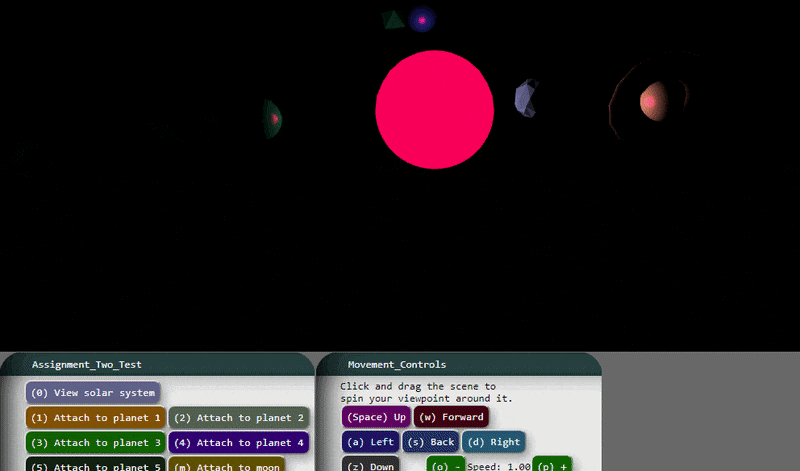

# Assignment #2

This is my first assignemnt for my Computer Graphics class. 
To see the resulting product, you can clone the repository and open the "index.html" file in your web browser.

I took the class in the Fall of 2018 at the University of California Los Angeles.
The assignment was made using Garett Ridge's educational graphics library "tiny-graphics.js" and "dependencies.js".

# Preview

